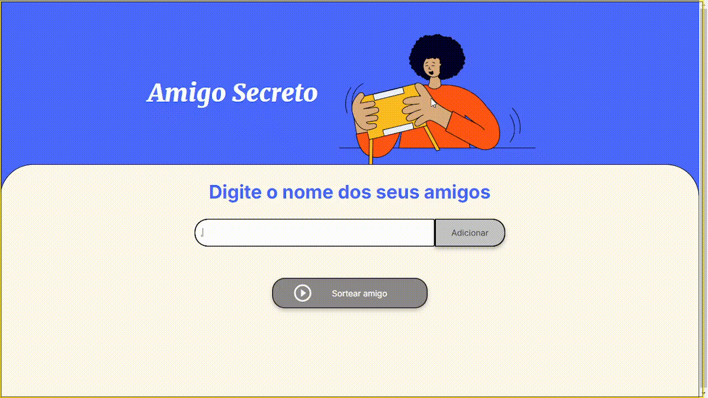
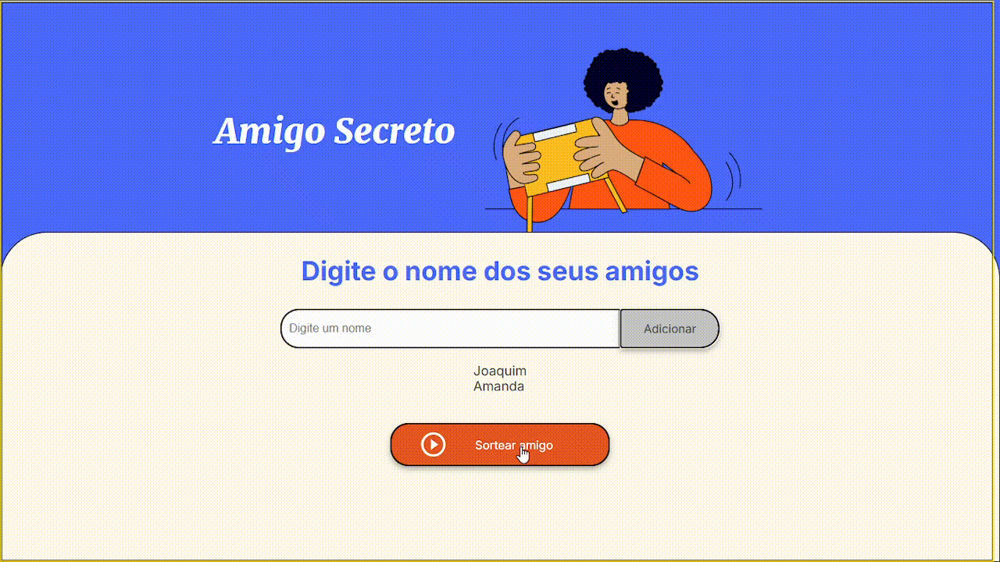

# Amigo Secreto 🎁

Bem-vindo ao **Amigo Secreto**, um site simples e interativo criado para facilitar o sorteio do tradicional jogo de amigo secreto entre amigos e familiares. Este projeto foi desenvolvido com o objetivo de ser funcional, visualmente agradável e interativo.

---

## 🚀 Funcionalidades Principais

1. **Adicionar Nomes**: Permite adicionar os nomes dos participantes do amigo secreto em uma lista.
2. **Sorteio Aleatório**: Um botão realiza o sorteio, revelando o amigo secreto do usuário.
3. **Interação Visual**:
   - A imagem principal muda entre **três temáticas** (Natal, Halloween e Sem Tema) ao clicar.
   - O resultado do sorteio é escondido por um botão que precisa ser clicado para revelar o amigo secreto.

---

## 📸 Capturas de Tela e Demonstração

### Interface Inicial


### Adicionando Participantes


### Sorteio e Revelação



## 🛠️ Como Usar o Projeto

### Passo a Passo

 Clone este repositório em sua máquina local:
   ```bash
   git clone https://github.com/KattyL/Amigo-Secreto.git


ou Ultilize agora mesmo no seu navegador!

[Acesse pelo GitHub Pages](https://kattyl.github.io/Amigo-Secreto/)

---

## 📸 Créditos

As imagens utilizadas neste projeto foram obtidas de fontes externas. Seguem os devidos créditos:

- **Imagem do Papai Noel com Chapéu Vermelho**  
  Disponível em: [Vecteezy](https://pt.vecteezy.com/png/35624962-santa-vermelho-natal-chapeu)

- **Imagem da Mulher com Tema Halloween**  
  Disponível em: [PNG Wing](https://www.pngwing.com/pt/free-png-ygqpd/download)

- **Ícone de Ocultação de Senha**  
  Disponível em: [Freepik](https://br.freepik.com/vetores-premium/icone-de-ocultacao-de-senha-icone-para-privacidade-de-dados-e-marca-de-conteudo-sensivel-ilustracao-vetorial_31770918.htm)

Agradeço aos criadores pela contribuição! :heart:
